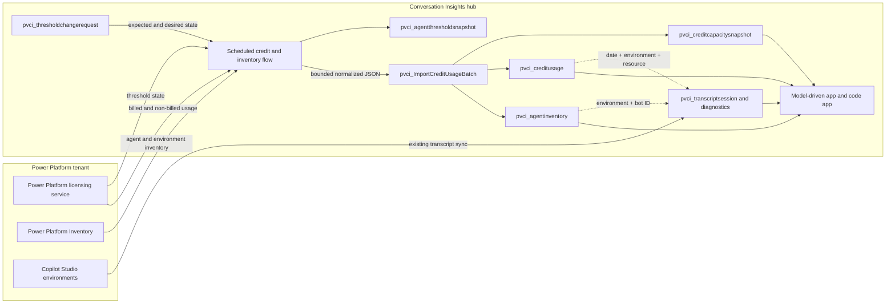

# Cross-environment Copilot credit consumption design

## Status

**Released in `1.3.0.0` on 2026-08-12 after PVE Dev hands-on approval, managed Sandbox upgrade
validation, CI, and public-package hash verification.**

Current implementation status:

- Delivered: licensing usage/capacity and tenant-wide user collection with overlap, paging,
  idempotent import, source lineage, privacy-controlled names, and separate sync health.
- Delivered: Admin V2/One Inventory environment and agent collection independent of usage,
  including zero-usage agents and direct `properties.isCLIAgent` classification.
- Delivered: read-only resource-threshold snapshots, risk bands, separate governance health, and
  human-readable agent/environment joins with unresolved controls retained.
- Delivered: `PVCI Apply Credit Governance Requests (scheduled)`, the Credit Administrator role,
  synchronous request guard, stale-state protection, one-resource threshold PUT, read-back, and
  before/after audit.
- Delivered: model-driven administration and preview code-app analysis/lifecycle surfaces.
- Still pending or intentionally excluded: completed PPAC CSV schema evidence, exact billing-event
  joins, per-user limit APIs, detailed Dataverse enrichment in every source environment, forecasts,
  and environment allocation/TenantPool/PayGo mutation.

The operational source of truth for the implemented grain and per-user boundary is
[Copilot Credit reporting](credit-reporting.md).

This design covers Copilot Studio harnesses. In particular, **GitHub Copilot harness** means the
new Copilot Studio authoring and orchestration runtime. It does not mean the separate GitHub
Copilot product, and this design does not use GitHub billing, seat, premium-request, or usage APIs.

The initial reporting scope is:

- standard harness agents,
- GitHub Copilot harness agents,
- all Power Platform environments in the tenant,
- billed and non-billed Copilot Credits,
- the features, channels, knowledge, tools, models, users, and execution contexts that the source
  data can support,
- correlation with the existing transcript, tool, outcome, and flow-run analytics.

The data model should reserve `copilot_chat` and `unknown` harness values so new or unresolved
resources are not silently counted as standard harness agents.

## Recommendation

Operate Conversation Insights as a tenant-level cost and operations hub with four evidence paths,
one guarded mutation path, and one shared Dataverse reporting model:

1. A central scheduled cloud flow reads Copilot Credit capacity and usage from the Power Platform
   licensing service through **HTTP with Microsoft Entra ID (preauthorized)**.
2. The same flow, or a second inventory flow, reads tenant-wide Copilot Studio agent metadata from
   **Power Platform Inventory** through Power Platform for Admins V2 or the public Power Platform
   Inventory API.
3. The existing transcript collection remains the session-level diagnostic source. It continues to
   run locally or through the proposed cross-environment hub-and-satellite design.
4. A new Dataverse Custom API and plug-in validate, normalize, deduplicate, and import bounded
   credit batches. The plug-in does not call the remote licensing service itself.
5. The model-driven app provides durable administration and auditable grids. The code app provides
   comparative analytics, contribution analysis, and drill-through to the likely operational
   drivers of usage.
6. A separate governance collector reads current agent/resource thresholds. Authorized users
  create guarded Dataverse requests; a privileged serial processor validates expected state,
  writes one resource threshold, and reads back without changing environment allocations.

This follows the same broad source pattern as Microsoft's open Copilot Agent Kit: agent inventory,
Power Platform licensing usage history, conversation transcripts, and optional Application
Insights telemetry are persisted in Dataverse and presented through a code app.

## What the HAR proves

The capture in `logs/admin.powerplatform.microsoft.com.har` was recorded on 2026-08-10. Request
headers and tokens were intentionally excluded from this analysis.

### Observed read contracts

| Purpose | Observed request | Important fields |
| --- | --- | --- |
| Tenant totals | `GET /v1.0/tenants/{tenantId}/CurrencyReports` | purchased, allocated, consumed by currency type |
| Tenant credit summary | `GET /v2.0/tenants/{tenantId}/entitlements/MCSMessages` | prepaid and pay-as-you-go entitlement and consumption |
| Environments | `GET /v2.0/tenants/{tenantId}/environments/entitlements/MCSMessages` | environment identity, allocation, consumption, available quantity, enforcement rules |
| Environments with consumption | `GET /v2.0/tenants/{tenantId}/environments/entitlementConsumptions/MCSMessages` | environments that currently have reportable consumption |
| Tenant daily trend | `GET /v1.0/tenants/{tenantId}/capacityTypes/MCSMessages/trends?interval=daily` | date, entitled, allocated, consumed |
| Per-resource usage | `GET /v2.0/tenants/{tenantId}/entitlements/MCSMessages/resources` | environment ID, resource ID, resource name, billed consumption, non-billable quantity, date |
| Per-resource user count | Same resource endpoint with `includeFields=users` | resource-level user count |
| Per-user usage | `GET /v2.0/tenants/{tenantId}/entitlements/MCSMessages/users` | user ID, billed consumption, non-billable quantity, resource count, date |
| Product snapshot | `GET /v0.1-alpha/tenants/{tenantId}/entitlements/MCSMessages/snapshot/product` | product name, prepaid consumed, pay-as-you-go consumed, as-of date |
| Resource snapshot | `GET /v0.1-alpha/tenants/{tenantId}/entitlements/MCSMessages/snapshot/resources` | snapshot count and as-of date |
| Agent limits | `GET /v1.0/tenants/{tenantId}/entitlements/MCSMessages/resourceThresholds` | resource ID, environment ID, limit, notification and hard-stop settings |
| Report jobs | `POST /v1.0/tenants/{tenantId}/Downloads` plus polling endpoints | report type, filters, status, file type, completion date |

The technical entitlement name is still `MCSMessages`, although Microsoft changed the business
term from messages to Copilot Credits on 2025-09-01. Persist both the source entitlement ID and a
normalized unit label. Do not rename or reinterpret source fields in a way that loses lineage.

The HAR also contains the legacy `MCSSessions` entitlement. That must remain a separate meter and
must never be added to Copilot Credits as if the units were interchangeable.

### Observed payload behavior

- Usage is aggregate and date-based, not an event stream with one record per model call.
- Per-resource, per-user, and per-environment payloads are separate projections. The HAR doesn't
  expose a resource-user-event fact table.
- Resource IDs are mixed. Many are GUIDs that can match Copilot Studio `botid`, but values such as
  `ESS IT` also occur. Background usage can be assigned to the all-zero user ID. The importer must
  preserve service, group, flow, and unresolved resources instead of forcing every row onto an
  agent or human user.
- `consumed` and `NonBillableQuantity` are distinct. A report that shows only billed credits would
  hide substantial test, licensed-user, or otherwise non-billed activity.
- Consumption is delayed and can be revised. The flow must re-read an overlap window and upsert,
  rather than treating yesterday as immutable.
- The PPAC page called Microsoft Graph only to resolve user IDs. No second agent metadata service
  was used by this page, so harness classification requires an explicit inventory join.
- The capture includes report requests for `CapacityConsumptionTenantDetailsReport` and
  `EntitlementConsumptionTenantPerUserDetailsReport`, but both jobs remained `NotStarted`. No CSV
  body or completed report schema is present in this HAR.

### Observed write contracts and the implemented boundary

The HAR contains `PUT /v0.1/tenants/{tenantId}/allocationsV2`, used to change an environment's
allocation, tenant-pool behavior, and alert threshold. PVCI does not call this route. Environment allocation, TenantPool, and PayGo mutation remain out of scope and require a separate approval,
privilege, audit, and rollback design.

Version `1.3.0.0` implements only the narrower documented Power Platform resource-threshold path:
the collector reads tenant-wide threshold state, and `PVCI Apply Credit Governance Requests
(scheduled)` can PUT one environment/resource threshold after a synchronous Create guard,
read-before-write expected-state comparison, and mandatory justification. A failed read-back after
an attempted PUT is `AppliedUnverified`, not Failed, so operators verify live state before retrying.

### Contract support level

Microsoft publicly documents the PPAC reporting experience and documents the preauthorized
licensing connection used by Copilot Agent Kit. The individual `v0.1-alpha`, `v1.0`, and `v2.0`
licensing routes aren't published as a conventional stable REST reference.

Treat the licensing integration as a versioned platform dependency:

- isolate endpoint construction in one flow or child flow,
- persist the source API version and a payload schema version,
- retain bounded raw source JSON for diagnostics,
- validate required fields before import,
- alert on unknown fields and missing fields,
- provide a manual CSV import fallback,
- never let a schema drift overwrite previously valid facts with zeroes.

## What public documentation adds

### Unified multi-harness reporting

Microsoft states that PPAC provides unified capacity management across Copilot chat, standard, and
GitHub Copilot harnesses. PPAC can show agent, environment, product, and feature-level billed versus
non-billed credits. The correct architecture is therefore one Copilot Studio credit fact model with
a harness dimension, not separate billing systems.

### Standard harness billing

The standard harness uses published feature rates. Current documented examples include classic
answers, generative answers, agent actions, tenant graph grounding, agent flow actions, AI tools,
and voice tiers. Employee-facing usage by an authenticated Microsoft 365 Copilot licensed user can
be non-billed for qualifying scenarios.

The rate table is reference data, not a replacement for actual PPAC consumption. Rates can change,
one interaction can incur multiple features, and included usage has eligibility rules.

### GitHub Copilot harness billing

The GitHub Copilot harness is the new Copilot Studio runtime for reasoning-heavy, multi-step work.
Its Copilot Credit usage covers LLM tokens, tools including knowledge and MCP, and the harness
itself. Unlike the standard harness, consumption can begin while building:

- natural-language creation and authoring,
- Preview/test-pane interactions,
- evaluation generation and execution,
- published runtime use.

Its task cost is variable. It must not be estimated by applying standard-harness answer/action
rates. The authoritative billed and non-billed values come from PPAC usage history.

### Copilot Agent Kit benchmark

Microsoft's open Copilot Agent Kit documents an `Agent Usage History` Dataverse table with this
source grain and fields:

- resource/agent ID and environment ID,
- billed and non-billed Copilot Credits,
- feature name,
- usage date and source week (`FromDate`, `ToDate`),
- channel ID,
- knowledge sources,
- users,
- tool invoked,
- LLM model.

The Kit currently describes the history as per-agent, per-feature, weekly usage with up to 180 days
of lookback. Its inventory also materializes feature totals for agent actions, agent-flow actions,
classic answers, generative answers, and basic, standard, and premium text/generative AI tools.

This is stronger evidence than the incomplete CSV capture and should be the minimum parity target
for the first usage importer.

### Agent inventory

Power Platform Inventory exposes `microsoft.copilotstudio/agents` across the tenant through:

- Power Platform for Admins V2 `Query Power Platform resources`,
- Power Platform Inventory REST API,
- Azure Resource Graph `PowerPlatformResources`.

Documented agent fields include bot ID, display and schema names, environment ID, creation and
publish dates, owner, authoring origin, model, authentication, orchestration, channels, connector
operations, and selected capabilities.

The current public schema does **not** document a direct harness field. `orchestration = Generative`
is not a harness discriminator because a standard-harness agent can also enable generative
orchestration. Harness must remain `unknown` until a direct platform property or a verified,
stable runtime/type marker is found.

## Reporting truth and attribution levels

Every visual and export must distinguish these levels:

| Level | Meaning | Allowed wording |
| --- | --- | --- |
| Actual | Value imported from PPAC usage history | "Billed credits", "Non-billed credits" |
| Exact join | Resource ID and environment match one inventory agent | "Attributed to agent" |
| Aggregate correlation | Usage bucket overlaps sessions, tools, evaluations, or runs for the same agent and period | "Likely drivers" |
| Estimate | Credits distributed over sessions or activities by an explicit model | "Estimated credits", with method and confidence |
| Unresolved | Source row cannot be matched without guessing | "Unresolved resource" |

Do not display an estimated per-session value as a bill. The available data supports strong
period-level explanation, but no reviewed source currently exposes a common billing-event ID that
joins an individual credit charge to one transcript activity.

## Dataverse model

### `pvci_agentinventory`

One row per tenant, environment, and resource/agent ID.

| Column group | Proposed values |
| --- | --- |
| Identity | tenant ID, environment ID/name/URL, resource ID, bot ID, display name, schema name |
| Classification | harness, resource type, authoring origin, orchestration type, model |
| Harness evidence | classification source, confidence, evidence JSON, last verified date, manual override |
| Lifecycle | created, modified, published, owner, status, managed state |
| Capabilities | tools, MCP, knowledge, prompts, evaluations, deep reasoning, file input, computer use |
| Operations | first/last usage date and feature, inventory source/version, last synced date |

Application key: normalized `<tenantId>:<environmentId>:<resourceId>`.

Harness choice values: `standard`, `github_copilot`, `copilot_chat`, `unknown`.

Harness classification priority:

1. Direct documented inventory/runtime property, if the live schema exposes one.
2. Direct immutable agent-type property proven by a controlled standard-versus-GitHub probe.
3. Administrator override with reason, author, and date.
4. `unknown`.

Never infer harness solely from generative orchestration, model name, MCP usage, skills, deep
reasoning, creation date, or presence of evaluations.

### `pvci_creditusage`

One row per source usage record. Preserve the source grain; do not manufacture daily rows from a
weekly fact or split an aggregate over users.

| Column group | Proposed values |
| --- | --- |
| Source key | stable hash of normalized source row, source API/report, schema version |
| Scope | tenant ID, environment ID, resource ID, optional agent lookup |
| Time | usage date, from date, to date, imported date |
| Billing | entitlement ID, source unit, billed credits, non-billed credits, pay-as-you-go/prepaid when supplied |
| Driver dimensions | feature name, channel ID, tool invoked, knowledge sources, LLM model, users |
| Classification | harness copied at query time through agent lookup, resource type, resolution status |
| Lineage | bounded raw source JSON, source payload hash, sync-run lookup |

The source key must include all driver dimensions and the source period. This avoids collapsing two
usage records that share an agent, feature, and date but differ by channel, model, or tool.

### `pvci_creditcapacitysnapshot`

One row per tenant/environment/entitlement/as-of date:

- entitled, allocated, auto-allocated, consumed, available, and pay-as-you-go quantities,
- status and last-updated date,
- draw-from-tenant-pool setting,
- alert enabled and threshold,
- captured date and source version.

This table supports capacity burn rate, forecast, and allocation recommendations without mutating
PPAC.

### `pvci_credituserusage` (optional, restricted)

Keep user usage separate from agent facts because it has a different grain and privacy profile.
Use field-level security and a dedicated role. Store Entra object ID and resolved display data only
when the reporting requirement and retention policy justify it.

### `pvci_creditsyncrun`

Store each collector invocation, requested periods, page counts, source counts, imported counts,
schema version, start/end, status, retry count, and bounded errors. This is separate from transcript
watermarks because licensing data can revise historical periods.

### Existing session extension

Add only narrow join and explanation fields to `pvci_transcriptsession`:

- lookup to `pvci_agentinventory`,
- harness snapshot and classification confidence,
- execution context: production, test pane, evaluation, authoring, autonomous, or unknown,
- optional attribution-status and attribution-method fields.

Do not copy billed credit totals onto every session. Period facts belong in `pvci_creditusage`.

## Flow and plug-in responsibilities

### Tenant credit collector flow

Use a solution-aware scheduled flow in the hub:

1. Run daily after PPAC's normal reporting delay.
2. Re-read at least the previous seven days to absorb late or revised usage.
3. Read capacity snapshots and paged usage history.
4. Preserve the source period and all optional driver dimensions.
5. Call `pvci_ImportCreditUsageBatch` with bounded JSON batches.
6. Record a sync run and isolate malformed rows instead of failing the whole period.
7. Support an on-demand backfill up to the source's verified maximum, initially 180 days.

The exact overlap and schedule should be adjusted after a two-week observation of source latency.

### Agent inventory collector

Run daily and before an on-demand usage backfill:

1. Query all `microsoft.copilotstudio/agents` through Power Platform Inventory.
2. Join environment resources for names, URLs, type, region, and managed state.
3. When authorized, enrich from local `bot` and `botcomponent` tables for configuration details.
4. Upsert inventory before importing usage so resource joins resolve immediately.
5. Keep resources that PPAC reports but inventory cannot see, with a visible unresolved status.

### Custom API and plug-in

Add a new unbound Custom API implemented in the existing plug-in assembly:

- `pvci_ImportCreditUsageBatch(PayloadJson, SourceSchemaVersion, DryRun)`
- validate tenant scope, field types, date bounds, decimal precision, and payload limits,
- compute stable source keys,
- upsert inventory, usage, snapshots, and sync status idempotently,
- return created/updated/skipped/rejected counts and bounded errors,
- reject a tenant mismatch,
- retain unknown feature and harness values rather than dropping the row.

An optional `pvci_ReconcileCreditAttribution` API can later refresh session lookups and aggregate
driver indicators. It should never recalculate or overwrite authoritative billed values.

The existing `pvci_SyncConversationTranscripts` plug-in remains responsible for local transcript
parsing. It should not receive Power Platform admin credentials or make outbound tenant licensing
calls from the sandbox.

## Harness and execution-context discovery spike

This must complete before schema implementation.

### Harness probe

Select at least two known agents in the same environment:

- one standard harness agent,
- one GitHub Copilot harness agent.

Capture and compare, read-only:

- the full Power Platform Inventory resource JSON,
- `bot` metadata and `configuration` JSON,
- relevant `botcomponent` types and templates,
- Copilot Studio list/detail network contracts,
- transcript metadata from one run of each.

The output is a fixture pair and a documented discriminator. A valid discriminator must be stable,
immutable across publish, and specific to harness. If none exists, harness remains a managed
administrator classification until Microsoft publishes one.

### Billing-context matrix

Generate low-volume, clearly timed activity and wait for PPAC's reporting delay:

| Harness | Context | Minimum activity |
| --- | --- | --- |
| Standard | Test pane | one classic answer, one generative answer, one tool call |
| Standard | Published | same controlled prompts through a published channel |
| GitHub Copilot | Preview/test pane | one simple and one multi-tool task |
| GitHub Copilot | Evaluation | one small evaluation set/run |
| GitHub Copilot | Published | one simple and one multi-tool task |

For each row, verify whether PPAC supplies feature, channel, tool, knowledge, model, users, and an
execution-context marker. Record billed and non-billed values exactly. Do not infer that a test or
evaluation run is identifiable merely because it is billable.

### Completed report capture

Capture a new HAR after a PPAC report reaches `Completed` and the CSV downloads. The current HAR
does not contain that artifact. Compare the CSV columns with Copilot Agent Kit's documented Agent
Usage History schema and preserve fixtures with tenant/user identifiers redacted.

## Model-driven app

The implemented **Credits and Capacity** group contains Agent Inventory, Credit Usage, Capacity,
and Sync Runs. It includes unresolved/unknown-harness views and source/evidence detail forms. The
following remain the target for later dashboard expansion:

- Credit overview dashboard,
- Agent inventory,
- Credit usage history,
- Capacity snapshots,
- Unresolved resources,
- Sync runs and rejected rows,
- Restricted user usage, if enabled.

Recommended views:

- Month-to-date usage by harness and environment,
- Billed and non-billed usage by agent and feature,
- GitHub harness preview/evaluation candidates,
- Standard harness production versus test,
- Agents nearing environment or agent limits,
- Usage with no inventory match,
- Usage with unknown harness,
- Large period-over-period changes,
- No-usage agents and orphaned owners.

Model-driven charts should remain simple and auditable. Complex contribution and correlation
analysis belongs in the code app.

## Code app

The top-level **Credits** workspace queries generated Dataverse services independently from the
current 200-session query. Its implemented overview includes billed/non-billed/total KPIs,
environment, agent/resource, billing-mode, and day/week source-period filters, source-period trend,
resource and feature contribution, capacity, freshness, and unresolved/unknown-harness indicators.
The remaining views below describe the broader target.

### Global filters

- date or source period,
- environment,
- harness,
- agent/resource,
- feature,
- billed versus non-billed,
- channel,
- execution context,
- model and tool when present.

### Primary views

1. **Overview**: billed, non-billed, total activity, allocation remaining, burn rate, projected
   month end, and data freshness.
2. **Harness comparison**: standard versus GitHub Copilot totals, active agents, median and p95
   credits per active day, and share of test/evaluation candidates.
3. **Agent contribution**: ranked agents with period change, features, channels, models, and limits.
4. **Feature mix**: actual PPAC feature contribution, with standard rate reference where applicable.
5. **Capacity**: environment allocation, tenant-pool behavior, projected exhaustion, and suggested
   read-only reallocation scenarios.
6. **Explain usage**: select an agent and period to compare actual credits with transcript count,
   user turns, test-mode sessions, evaluation windows, tool calls, knowledge use, flow actions,
   failures, latency, and outcomes.
7. **Data quality**: unresolved resources, unknown harnesses, missing periods, source revisions, and
   stale collectors.

Every drill-down must display `Actual`, `Correlated`, or `Estimated` status. Tooltips should state
the grain and source period so weekly usage is not mistaken for an event-level bill.

## Going beyond PPAC

The solution can safely add value in areas PPAC doesn't currently combine in one view:

### Durable history and comparison

- Retain normalized history beyond PPAC's interactive windows, subject to policy.
- Compare harnesses, environments, agents, owners, business units, channels, and features.
- Track configuration changes alongside consumption change points.

### Explainability

- Correlate billed and non-billed usage with actual transcript volume and test mode.
- Show tool, flow, knowledge, model, and evaluation signals beside the PPAC feature facts.
- Identify expensive periods that also had failures, retries, abandonment, or low resolution.
- Separate useful non-billed adoption from chargeable growth instead of treating it as zero usage.

### Efficiency metrics

Examples, always labeled as ratios rather than billing facts:

- actual credits per conversation or run in the same source period,
- credits per resolved session,
- credits per successful tool outcome,
- billed-to-non-billed ratio,
- credits per active user,
- failed-tool and failed-flow credits-at-risk indicators,
- test/evaluation share for GitHub harness agents.

### Forecasting and anomaly detection

- month-end forecast with confidence band,
- days to environment allocation exhaustion,
- week-over-week and same-weekday anomaly detection,
- new agent or model change attribution,
- sustained test/evaluation consumption alerts,
- large unresolved-resource alerts.

### Optimization guidance

Generate evidence-backed recommendations such as:

- investigate repeated tool failures before adding capacity,
- move load tests and evaluations into explicit budget windows,
- compare model choice and task complexity for GitHub harness agents,
- reduce unnecessary grounding or tool calls when PPAC feature facts and transcripts agree,
- reallocate prepaid capacity only after forecast and business-owner review.

Do not claim exact causal savings unless a controlled before/after test confirms them.

## Security, privacy, and licensing

### Connections and roles

- The licensing connection requires a Power Platform admin-capable identity. Microsoft documents
  HTTP with Microsoft Entra ID (preauthorized) with base resource URL and resource URI
  `https://licensing.powerplatform.microsoft.com/` for commercial cloud.
- Full local inventory enrichment requires system administrator access in each environment. One
  Inventory still provides partial tenant inventory when local access is unavailable.
- Validate service-principal support for each connector before selecting the runtime owner. Do not
  assume the existing Dataverse service-principal connection can call the licensing service.
- If a dedicated admin user connection is required, use a controlled non-personal operational
  account, document rotation and break-glass procedures, and monitor connection health.
- HTTP with Entra ID and Dataverse are premium connectors. Confirm Process/per-flow licensing for
  the unattended scheduled collector.

### Least privilege and data protection

- Keep usage, capacity, and Inventory collection read-only. Restrict writes to the audited
  per-resource threshold processor; do not add allocation/TenantPool/PayGo routes to that flow.
- Separate deployment, collector, analyst, and user-detail roles.
- Apply field-level security to user identifiers and raw payloads.
- Do not store access tokens, connection secrets, or report download URLs.
- Bound raw JSON and define retention independently for usage, user, and transcript data.
- Audit manual harness overrides and all source/reconciliation configuration changes.
- Confirm DLP allows the preauthorized HTTP connector and Dataverse in the collector environment.

## Delivery phases

| Phase | `1.3.0.0` status | Remaining work |
| --- | --- | --- |
| Contract and classification proof | Partial | Direct GitHub discriminator and observed API schemas are proven; completed PPAC CSV and a broader controlled billing matrix remain pending |
| Dataverse schema and importer | Delivered | Continue schema-drift fixtures as Microsoft changes payloads |
| Scheduled collectors | Delivered for usage, capacity, users, inventory, and thresholds | 180-day backfill and CSV fallback remain future work |
| Model-driven app | Delivered | Add richer charts only when source grain remains explicit |
| Code app reporting | Delivered for overview, source-period trends, correlation context, risk, privacy, and request lifecycle | Export and advanced forecast experiences remain future work |
| Guarded threshold changes | Delivered | Per-user limits and environment allocation are not implemented |
| Test, review, and release | Delivered for `1.3.0.0` | Continue reconciliation over longer reporting periods and repeat managed-upgrade validation for each release |

## Acceptance criteria

These are the design target, not a claim that every optional source dimension is populated. The
released surfaces label missing dimensions, unresolved identities, and correlation boundaries
instead of manufacturing data.

- All tenant environments and all PPAC-reported resources are represented, including unresolved
  and non-GUID resources.
- Actual billed and non-billed values reconcile with PPAC within documented source delay.
- Standard and GitHub Copilot harness totals are separated only by verified classification.
- Unknown harness records are visible and excluded from misleading comparisons.
- GitHub harness test and evaluation activity is collected when PPAC reports it; unsupported
  execution-context attribution remains clearly unknown or estimated.
- Usage history preserves source feature, channel, model, knowledge, tool, user, and period fields
  when supplied.
- Re-running any source period creates no duplicate facts and accepts legitimate revisions.
- The plug-in holds no remote credentials and performs no licensing-service HTTP call.
- Model-driven and code apps show source freshness, grain, lineage, and attribution confidence.
- User-level usage is secured separately.
- No allocation or hard-stop setting is changed by the reporting solution.

## Decisions required before implementation

1. Approve using the Power Platform licensing service through the documented Copilot Agent Kit
   connection pattern, with a manual CSV fallback and explicit contract monitoring.
2. Approve Power Platform Inventory as the tenant-wide agent source.
3. Approve retaining detailed usage history beyond PPAC's current interactive window.
4. Confirm production roles, retention, and export controls for the implemented GUID-first user
  reporting and shared name-disclosure approval.
5. Decide whether optional Application Insights integration should be included for richer
   event-level explanation, or whether existing transcript telemetry is sufficient initially.
6. Approve the controlled low-volume billing probe for standard and GitHub harness contexts.

## Primary references

- [Manage Copilot Studio credits and capacity](https://learn.microsoft.com/power-platform/admin/manage-copilot-studio-messages-capacity)
- [Choose a Copilot Studio harness](https://learn.microsoft.com/microsoft-copilot-studio/harnesses-overview)
- [GitHub Copilot harness billing](https://learn.microsoft.com/microsoft-copilot-studio/agents-experience/billing-credit-overview)
- [Standard harness billing rates and management](https://learn.microsoft.com/microsoft-copilot-studio/requirements-messages-management)
- [Standard harness agent billing analytics](https://learn.microsoft.com/microsoft-copilot-studio/analytics-consumption)
- [GitHub harness Monitor](https://learn.microsoft.com/microsoft-copilot-studio/agents-experience/analytics-overview)
- [Power Platform Inventory API](https://learn.microsoft.com/power-platform/admin/inventory-api)
- [Copilot Studio Agent inventory schema](https://learn.microsoft.com/microsoft-copilot-studio/admin-agent-inventory)
- [Copilot Agent Kit Agent Inventory](https://learn.microsoft.com/microsoft-copilot-studio/guidance/kit-agent-inventory)
- [Copilot Agent Kit Agent Insights Hub](https://learn.microsoft.com/microsoft-copilot-studio/guidance/kit-agent-insights-hub)
- [Copilot Agent Kit source](https://github.com/microsoft/Power-CAT-Copilot-Studio-Kit)
- [Copilot Agent Kit usage-history schema](https://github.com/microsoft/Power-CAT-Copilot-Studio-Kit/blob/main/AGENT_INVENTORY_DATA_SOURCE.md)
