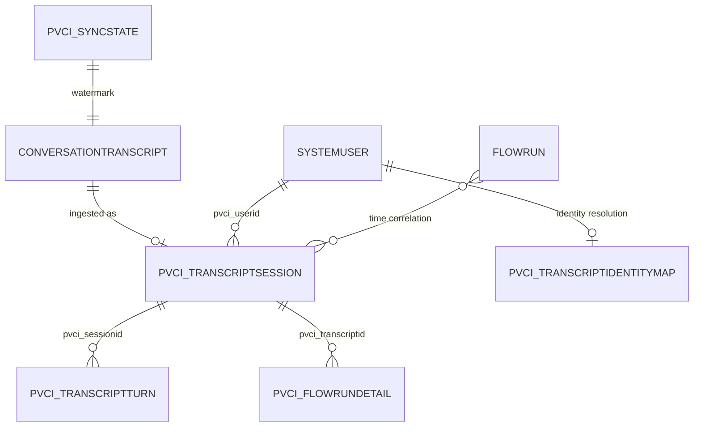

# Dataverse data model

PV Conversation Insights stores derived transcript analytics in five custom Dataverse tables. It
reads native Dataverse tables but does not modify them. Logical names are used throughout this
reference because they are shared by the plugin, Python tools, code app, and Web API.

## Relationship model

The session-to-turn relationship is the custom parent/child relationship. Flow details use
`pvci_transcriptid` as a durable correlation key because run enrichment is asynchronous. Identity
map rows cache resolution results; each session also retains a direct `systemuser` lookup.

## Table inventory

| Purpose | Logical name | Grain | Application key |
|---|---|---|---|
| Transcript session | `pvci_transcriptsession` | One row per Copilot Studio transcript | `pvci_transcriptid` |
| Transcript turn | `pvci_transcriptturn` | One retained activity per transcript | Session + `pvci_turnindex` |
| Identity map | `pvci_transcriptidentitymap` | One row per observed Entra object ID | `pvci_aadobjectid` |
| Flow run detail | `pvci_flowrundetail` | One row per correlated Power Automate run | `pvci_runname` |
| Sync state | `pvci_syncstate` | One row per sync scope | `pvci_name` (`default`) |

These are idempotency keys used by the sync implementations. They are not Dataverse alternate-key
metadata.

## `pvci_transcriptsession`

The session is the aggregate and primary UI entry point. It combines source identity, resolved
user information, environment provenance, metrics, outcomes, and bounded JSON payloads.

### Identity and provenance

| Column | Type | Meaning |
|---|---|---|
| `pvci_name` | Text | User, channel, and start-time label |
| `pvci_transcriptid` | Text | Native `conversationtranscriptid` and idempotency key |
| `pvci_botid` | Text | Stable agent ID from `metadata.BotId` |
| `pvci_botname` | Text | Display name resolved from native `bot` |
| `pvci_tenantid` | Text | `metadata.AADTenantId`; retained for audit, not used as a picker |
| `pvci_environmentid` | Text | Source Dataverse organization/environment ID |
| `pvci_environmentname` | Text | Source environment friendly name |
| `pvci_datasource` | Text | Source, tenant, environment, and organization lineage stamp |
| `pvci_transcriptcreatedon` | Date/time | Native transcript creation time |
| `pvci_ingestedon` | Date/time | Last derived-session write time |
| `pvci_correlationstatus` | Text | `exact`, `heuristic`, or `unmatched` user resolution |

The plugin resolves environment data from its `IPluginExecutionContext` and
`organization.friendlyname`. Python uses the configured `environmentId`, accepts an optional
`environmentName` override, and queries `organization` for missing values. Environment identifies
where the transcript was read; tenant and agent identity come from transcript telemetry.

### User and conversation

| Column | Type | Meaning |
|---|---|---|
| `pvci_userid` | Lookup to `systemuser` | User resolved from `from.aadObjectId` |
| `pvci_useraadobjectid` | Text | Entra object ID observed in activities |
| `pvci_userupn` | Text | Resolved `systemuser.domainname` |
| `pvci_userdisplayname` | Text | Resolved `systemuser.fullname` |
| `pvci_channel` | Text | Channel such as `m365copilot` or `msteams` |
| `pvci_startdatetimeutc` | Date/time | Earliest activity timestamp |
| `pvci_enddatetimeutc` | Date/time | Latest activity timestamp |
| `pvci_durationseconds` | Integer | End minus start |
| `pvci_initialusermessage` | Multiline text | First user message |
| `pvci_lastagentmessage` | Multiline text | Last agent message |
| `pvci_istestmode` | Yes/No | Maker test-chat signal |
| `pvci_multiuseranomaly` | Yes/No | More than one end-user object ID observed |

### Metrics and outcomes

| Group | Columns | Meaning |
|---|---|---|
| Activity counts | `pvci_activitycount`, `pvci_messagecount`, `pvci_eventcount` | Parsed activity totals |
| Turn counts | `pvci_userturncount`, `pvci_agentturncount`, `pvci_turncount` | Derived and `SessionInfo` counts |
| Reply latency | `pvci_firstresponsems`, `pvci_avgresponsems`, `pvci_maxresponsems` | User message to first agent reply |
| Tool metrics | `pvci_toolcallcount`, `pvci_toolerrorcount`, `pvci_tooltotalms`, `pvci_maxtoolms` | Invocation aggregates |
| Flow metrics | `pvci_flowruncount`, `pvci_flowrunfailurecount`, `pvci_flowrunmaxms` | Correlated run aggregates |
| Outcome | `pvci_sessionoutcome`, `pvci_outcomereason`, `pvci_isresolvedimplied` | `SessionInfo` values |
| Payload safety | `pvci_payloadtruncated` | A JSON payload exceeded the storage guard |

### JSON and legacy Monitor columns

| Column | Contents |
|---|---|
| `pvci_activitiesjson` | Filtered Bot Framework activities |
| `pvci_conversationjson` | Ordered user/agent conversation |
| `pvci_planeventsjson` | `DynamicPlan*` reasoning events |
| `pvci_metadatajson` | Native transcript metadata |
| `pvci_toolcallsjson` | Tool duration, output, and exception data |
| `pvci_flowrunsjson` | Correlation windows, candidate runs, confidence, and offsets |
| `pvci_monitorsessionid`, `pvci_embeddedconversationguid` | Legacy Monitor identifiers |
| `pvci_topicname`, `pvci_topicid`, `pvci_csat`, `pvci_comments` | Legacy Monitor values |
| `pvci_rawchattranscript`, `pvci_parsedturnsjson` | Legacy Monitor payloads |

Memo values are capped at 900,000 characters, below the Dataverse 1,048,576-character limit.

## `pvci_transcriptturn`

| Column | Type | Meaning |
|---|---|---|
| `pvci_name` | Text | Sequence, speaker, and activity type |
| `pvci_sessionid` | Lookup to session | Owning session |
| `pvci_transcriptid` | Text | Parent correlation key |
| `pvci_turnindex` | Integer | Retained-activity order |
| `pvci_activitytype` | Text | Bot Framework activity type |
| `pvci_speaker` | Text | Derived `user` or `agent` |
| `pvci_role` | Integer | Raw sender role |
| `pvci_aadobjectid` | Text | Sender Entra object ID when present |
| `pvci_eventname` | Text | Event name |
| `pvci_channelid` | Text | Raw channel ID |
| `pvci_timestamputc` | Date/time | Activity timestamp |
| `pvci_turntext` | Multiline text | Message text |
| `pvci_latencyms` | Integer | First agent reply latency after a user message |
| `pvci_valuejson` | Multiline text | Serialized activity `value` |
| `pvci_monitorsessionid` | Text | Legacy Monitor correlation |

Default sync excludes `trace` and `DialogTracing`. Reprocessing inserts replacement turns before
deleting stale rows so a failed run cannot leave an empty session.

## `pvci_transcriptidentitymap`

| Column | Type | Meaning |
|---|---|---|
| `pvci_name` | Text | Display name or Entra object ID |
| `pvci_aadobjectid` | Text | Identity-map key |
| `pvci_userprincipalname` | Text | Resolved UPN/domain name |
| `pvci_displayname` | Text | Resolved full name |
| `pvci_systemuserid` | Text | Resolved Dataverse user GUID |
| `pvci_correlationsource` | Text | `conversationtranscript.from.aadObjectId` |
| `pvci_correlationconfidence` | Text | `exact` or `unresolved` |
| `pvci_lastseenon` | Date/time | Last observation |
| `pvci_sessioncount` | Integer | Reserved aggregate count when populated |

## `pvci_flowrundetail`

A row can be created as a pending enrichment placeholder. `pvci_fetchedon` indicates that trigger,
action, response, and repetition payload collection completed.

| Group | Columns |
|---|---|
| Identity | `pvci_name`, `pvci_runname`, `pvci_flowapiid`, `pvci_workflowentityid`, `pvci_flowdisplayname` |
| Correlation | `pvci_transcriptid` |
| Lifecycle | `pvci_status`, `pvci_starttime`, `pvci_endtime`, `pvci_durationms`, `pvci_fetchedon` |
| Counts | `pvci_actioncount`, `pvci_failedactioncount`, `pvci_skippedactioncount` |
| Payloads | `pvci_triggerjson`, `pvci_actionsjson`, `pvci_errorsummary`, `pvci_payloadtruncated` |

## `pvci_syncstate`

| Column | Type | Meaning |
|---|---|---|
| `pvci_name` | Text | Scope key, currently `default` |
| `pvci_lastsyncedcreatedon` | Date/time | Inclusive transcript watermark |
| `pvci_lastrunon` | Date/time | Last invocation |
| `pvci_lastrunstatus` | Text | `success`, `partial`, or `failed` |
| `pvci_recordsprocessed` | Integer | Last-run transcript count |
| `pvci_lasterror` | Multiline text | Bounded per-transcript errors |

The source query uses `createdon ge watermark`. Re-reading the boundary is intentional because
upsert is idempotent and `gt` could miss records created in the same timestamp tick.

## Native tables read

| Native table | Use |
|---|---|
| `conversationtranscript` | Metadata and Bot Framework activity stream |
| `systemuser` | Resolve end-user identity |
| `bot` | Resolve agent display name |
| `organization` | Resolve environment ID and friendly name |
| `flowrun` | Correlate Power Automate runs |
| `workflow` | Bridge Dataverse workflow and Flow API identifiers |

Deleting a session should remove child turns through the configured parental relationship.
Identity-map and flow-detail rows are independent and need explicit retention policies. Native
transcript and flow-run retention is controlled separately by their owning Microsoft services.
