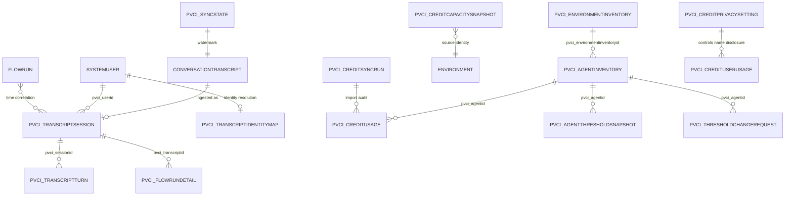

# Dataverse data model

PV Conversation Insights stores derived transcript analytics, tenant inventory, and Copilot Credit
reporting facts in 17 custom Dataverse tables. It reads native Dataverse, Power Platform
inventory, and licensing data but does
not modify transcript, usage, capacity-allocation, tenant-pool, or PAYG source records. Its only
platform mutation is an explicitly requested, audited per-resource threshold change. Logical names are used throughout this
reference because they are shared by the plugin, Python tools, code app, and Web API.

In the stable `2.1.0.0` release, every table remains owned by required `pvConversationInsights` core.
The optional `pvConversationInsightsCredits` solution owns no schema: it contributes only the
unchanged `2.0.0.5` licensing runtime with three credit flows and two licensing connection references. Existing credit,
capacity, privacy, threshold, governance, and sync rows therefore remain in place during the
additive upgrade from `1.4.0.15`; installing or removing the runtime add-on does not transfer table
or data ownership. The release was validated in PVE and passed the user-performed manual Contoso TPM upgrade.

## Relationship model

The session-to-turn relationship is the custom parent/child relationship. Flow details use
`pvci_transcriptid` as a durable correlation key because run enrichment is asynchronous. Identity
map rows cache resolution results; each session also retains a direct `systemuser` lookup.

## Table inventory

| Purpose | Logical name | Grain | Application key |
| --- | --- | --- | --- |
| Transcript session | `pvci_transcriptsession` | One row per Copilot Studio transcript | `pvci_transcriptid` |
| Transcript turn | `pvci_transcriptturn` | One retained activity per transcript | Session + `pvci_turnindex` |
| Identity map | `pvci_transcriptidentitymap` | One row per observed Entra object ID | `pvci_aadobjectid` |
| Flow run detail | `pvci_flowrundetail` | One row per correlated Power Automate run | `pvci_runname` |
| Sync state | `pvci_syncstate` | One row per sync scope | `pvci_name` (`default`) |
| Environment inventory | `pvci_environmentinventory` | One row per tenant environment, including operator-managed transcript enablement, access-probe state, and collection health | `pvci_sourcekey` alternate key |
| Transcript access request | `pvci_transcriptaccessrequest` | One user-owned audited onboarding command and processor result | `pvci_requestkey` alternate key |
| Inventory sync run | `pvci_inventorysyncrun` | One row per inventory invocation | `pvci_runkey` alternate key |
| Agent inventory | `pvci_agentinventory` | One row per tenant, environment, and observed resource | `pvci_sourcekey` alternate key |
| Agent threshold snapshot | `pvci_agentthresholdsnapshot` | One row per tenant, environment, resource, entitlement, and source day | `pvci_sourcekey` alternate key |
| Governance sync run | `pvci_governancesyncrun` | One row per threshold collector invocation | `pvci_runkey` alternate key |
| Threshold change request | `pvci_thresholdchangerequest` | One audited requested platform change | `pvci_requestkey` alternate key |
| Credit usage | `pvci_creditusage` | One row per PPAC resource/source-period fact | `pvci_sourcekey` alternate key |
| Capacity snapshot | `pvci_creditcapacitysnapshot` | One row per tenant, environment, entitlement, and as-of date | `pvci_sourcekey` alternate key |
| Credit sync run | `pvci_creditsyncrun` | One row per collector/import invocation | `pvci_runkey` alternate key |
| Credit user usage | `pvci_credituserusage` | One row per PPAC user/source-period fact | `pvci_sourcekey` alternate key |
| Credit privacy approval | `pvci_creditprivacysetting` | Singleton shared disclosure setting | `pvci_settingkey` alternate key |

The first five application keys are idempotency keys used by transcript sync and are not Dataverse
alternate-key metadata. Inventory and credit reporting tables use real Dataverse alternate keys
provisioned by the solution.

## Transcript runtime diagnostics

`pvci_transcriptsession` stores filterable summaries for user-facing runtime failures:

| Column | Meaning |
| --- | --- |
| `pvci_usererrorcount` | Count of `ErrorTraceData` activities explicitly marked `isUserError=true` |
| `pvci_primaryerrorcode` | Code from the last user-facing error in transcript order |
| `pvci_primaryerrormessage` | Full retained primary error message; loaded only for session detail |
| `pvci_primaryerrortopic` | DynamicPlan topic active when the primary error occurred |
| `pvci_errorcategory` | Bounded operational category for filtering and triage |
| `pvci_topicname`, `pvci_topicid` | First triggered DynamicPlan topic fallback when Monitor values are unavailable |
| `pvci_knowledgecallcount` | Number of retained `KnowledgeTraceData` retrieval outcomes |
| `pvci_knowledgesourcecount` | Total cited source identifiers across retrievals |
| `pvci_knowledgefailurecount` | Retrievals with failed source types or incomplete completion state |
| `pvci_knowledgecallsjson` | Compact status/timing/source metadata without query or passage content |

The corresponding `ErrorTraceData` activities remain in `pvci_transcriptturn` even when generic
trace retention is disabled. Detailed timelines are reconstructed from ordered turns rather than
duplicated into another memo column. Error messages can contain implementation details and remain
subject to the same Dataverse access, retention, and privacy controls as the transcript payload.

## Credit reporting tables

### `pvci_environmentinventory`

Stores every environment returned by Power Platform for Admins V2 independently of capacity or
credit activity: tenant/environment identity, display name, URL, type, geography, state, managed
and Dataverse signals, detailed-access status, source schema, bounded raw JSON, and freshness. It
also stores central transcript access status/reason, probe timestamp/sample count, collector
enablement, per-source watermark, last batch size, collection status, and bounded collection error.
Onboarding fields separately store `SourceManaged`, `AdministratorBootstrap`, or `Excluded` mode;
lifecycle status; last verification; role and elevation-cleanup evidence; collector application ID;
and the last bounded onboarding error. A readable probe does not set role or cleanup proof flags.

### `pvci_transcriptaccessrequest`

Stores the immutable requested source, action, mode, request key, and request timestamp together
with processor-owned status, access result, evidence, error, processing timestamp, and role/cleanup
proof flags. Credit Administrators can create and read requests but cannot mark them successful.
`PVCI Source Access Processor` can read and update outcomes. The packaged verifier consumes only
`Pending` requests whose action is `Verify`; bootstrap actions remain reserved for the external
reconciler.

### `pvci_inventorysyncrun`

Stores each standalone inventory invocation with environment/agent source counts, create/update/
reject outcomes, schema version, timestamps, status, and bounded errors. Inventory health remains
separate from credit-collection health.

### `pvci_agentinventory`

Stores resource identity, canonical environment lookup, display/schema names, resource type,
lifecycle metadata, and harness classification evidence. PPAC One Inventory supplies tenant-wide
base metadata, including agents with zero credit usage; billing-only resources remain visible when
inventory cannot resolve them. Direct `isCLIAgent=true` maps to GitHub Copilot, false maps only to
not-GitHub, and missing evidence remains unknown.

### `pvci_agentthresholdsnapshot`

Stores daily read-only copies of Power Platform resource thresholds: canonical tenant/environment/
resource identity, entitlement, monthly limit, current consumption, notification threshold,
notification flag, stop-at-limit flag, explicit-stop flag, source timestamps, raw JSON, and an
optional exact Agent Inventory lookup. The source key includes the source day so history is retained.

### `pvci_governancesyncrun`

Stores governance collector source count, create/update/reject outcomes, status, timestamps,
schema version, and bounded errors independently of credit and inventory health.

### `pvci_thresholdchangerequest`

User-owned audited queue for privileged threshold changes. It stores canonical environment/resource
identity, desired and expected state, justification, processing status/timestamps, before/after
JSON, and bounded errors. Credit Administrators can create/read requests; the flow owner writes
processing outcomes. Analysts and Privacy Approvers have read-only audit access.

The lifecycle values are `Pending`, `Processing`, `Succeeded`, `Stale`, `Failed`, and
`AppliedUnverified`. The synchronous Create plug-in always forces `Pending` and server time and
removes caller-supplied processed time, before JSON, after JSON, and error. Credit Administrators
cannot update the row. `AppliedUnverified` is intentionally distinct from Failed because the
per-resource threshold PUT may have succeeded even when read-back or audit persistence did not.

### `pvci_creditusage`

Stores authoritative billed and non-billed PPAC facts at the source grain. Important groups are:

| Group | Columns |
| --- | --- |
| Scope | `pvci_tenantid`, `pvci_environmentid`, `pvci_resourceid`, `pvci_agentid`, `pvci_agentname` |
| Period | `pvci_usagedate`, `pvci_fromdate`, `pvci_todate`, `pvci_importedon` |
| Billing | `pvci_entitlementid`, `pvci_sourceunit`, `pvci_billedcredits`, `pvci_nonbilledcredits` |
| Drivers | `pvci_featurename`, `pvci_channelid`, `pvci_toolinvoked`, `pvci_knowledgesources`, `pvci_llmmodel`, `pvci_users` |
| Quality | `pvci_harness`, `pvci_resourcetype`, `pvci_resolutionstatus` |
| Lineage | `pvci_sourcekey`, `pvci_sourceapi`, `pvci_sourceschemaversion`, `pvci_rawjson` |

`pvci_usagedate` is the source row's `asOfDate`; it is not automatically evidence of daily billing
grain. Preserve `from/to` dates when supplied, and never split weekly or aggregate facts into
manufactured daily/session values.

### `pvci_creditcapacitysnapshot`

Stores entitled, allocated, auto-allocated, consumed, available, and PAYG quantities with source
date, environment, tenant-pool policy, alert state/threshold, source route, and bounded raw JSON.
This table is read-only reporting; the solution does not call PPAC allocation mutation routes.

### `pvci_creditsyncrun`

Stores source/schema, requested period, page and source counts, create/update/skip/reject counts,
status, timestamps, and bounded errors. Credit history can revise, so this audit is separate from
the transcript watermark.

### `pvci_credituserusage`

The observed users endpoint has a different grain from resource usage and includes source user ID,
billed/non-billed values, resource metadata, source date, and unit. The organization-owned table
stores those facts separately with an alternate source key. Its primary name equals `pvci_userid`
until shared disclosure is approved. Optional resolved fields are `pvci_userdisplayname`,
`pvci_userprincipalname`, `pvci_systemuserid`, and `pvci_nameresolutionstatus`.

### `pvci_creditprivacysetting`

The singleton key `credit-user-disclosure` controls both apps. `pvci_revealusernames` defaults to
false; approval statement, initiating user ID/name, approved date, and revoked date provide the
audit. A synchronous post-update plug-in resolves or clears every user fact. Approval is global,
not per viewer, so write access to this table must be restricted to authorized approvers. Resource
and user projections retain independent totals to prevent double-counting. See
[Copilot Credit reporting](credit-reporting.md#per-user-consumption).

## `pvci_transcriptsession`

The session is the aggregate and primary UI entry point. It combines source identity, resolved
user information, environment provenance, metrics, outcomes, and bounded JSON payloads.

### Identity and provenance

| Column | Type | Meaning |
| --- | --- | --- |
| `pvci_name` | Text | User, channel, and start-time label |
| `pvci_transcriptid` | Text | Native `conversationtranscriptid` and idempotency key |
| `pvci_botid` | Text | Stable agent ID from `metadata.BotId` |
| `pvci_botname` | Text | Display name resolved from native `bot` |
| `pvci_tenantid` | Text | `metadata.AADTenantId`; retained for audit, not used as a picker |
| `pvci_environmentid` | Text | Power Platform environment GUID |
| `pvci_environmentname` | Text | Source environment friendly name |
| `pvci_datasource` | Text | Source, tenant, environment, and organization lineage stamp |
| `pvci_transcriptcreatedon` | Date/time | Native transcript creation time |
| `pvci_ingestedon` | Date/time | Last derived-session write time |
| `pvci_correlationstatus` | Text | `exact`, `heuristic`, or `unmatched` user resolution |

The plugin reads the Power Platform GUID from `IPluginExecutionContext6.EnvironmentId` and the
friendly name from `organization.friendlyname`. Python requires the same Power Platform GUID in
the configured `environmentId`, accepts an optional `environmentName` override, and queries
`organization` only for a missing friendly name. Dataverse organization name remains in the
`org:` lineage segment; it is never substituted for `pvci_environmentid`. Environment identifies
where the transcript was read, while tenant and agent identity come from transcript telemetry.

### User and conversation

| Column | Type | Meaning |
| --- | --- | --- |
| `pvci_userid` | Lookup to `systemuser` | User resolved from `from.aadObjectId` |
| `pvci_useraadobjectid` | Text | Entra object ID observed in activities |
| `pvci_userupn` | Text | Resolved `systemuser.domainname` |
| `pvci_userdisplayname` | Text | Resolved `systemuser.fullname` |
| `pvci_channel` | Text | Channel such as `m365copilot` or `msteams` |
| `pvci_startdatetimeutc` | Date/time | Earliest activity timestamp |
| `pvci_enddatetimeutc` | Date/time | Latest activity timestamp |
| `pvci_durationseconds` | Integer | End minus start |
| `pvci_initialusermessage` | Multiline text | First user message |
| `pvci_lastagentmessage` | Multiline text | Last agent message |
| `pvci_istestmode` | Yes/No | Maker test-chat signal |
| `pvci_multiuseranomaly` | Yes/No | More than one end-user object ID observed |

### Metrics and outcomes

| Group | Columns | Meaning |
| --- | --- | --- |
| Activity counts | `pvci_activitycount`, `pvci_messagecount`, `pvci_eventcount` | Parsed activity totals |
| Turn counts | `pvci_userturncount`, `pvci_agentturncount`, `pvci_turncount` | Derived and `SessionInfo` counts |
| Reply latency | `pvci_firstresponsems`, `pvci_avgresponsems`, `pvci_maxresponsems` | User message to first agent reply |
| Tool metrics | `pvci_toolcallcount`, `pvci_toolerrorcount`, `pvci_tooltotalms`, `pvci_maxtoolms` | Invocation aggregates |
| Flow metrics | `pvci_flowruncount`, `pvci_flowrunfailurecount`, `pvci_flowrunmaxms` | Nullable source-local time-correlated run aggregates; null means source flow telemetry was unavailable |
| Outcome | `pvci_sessionoutcome`, `pvci_outcomereason`, `pvci_isresolvedimplied` | `SessionInfo` values |
| Payload safety | `pvci_payloadtruncated` | A JSON payload exceeded the storage guard |

### JSON and legacy Monitor columns

| Column | Contents |
| --- | --- |
| `pvci_activitiesjson` | Filtered Bot Framework activities |
| `pvci_conversationjson` | Ordered user/agent conversation |
| `pvci_planeventsjson` | `DynamicPlan*` reasoning events |
| `pvci_metadatajson` | Native transcript metadata |
| `pvci_toolcallsjson` | Tool duration, output, and exception data |
| `pvci_flowrunsjson` | Nullable source-local correlation windows, candidate runs, workflow names, and offsets; null for central source transcripts |
| `pvci_monitorsessionid`, `pvci_embeddedconversationguid` | Legacy Monitor identifiers |
| `pvci_topicname`, `pvci_topicid`, `pvci_csat`, `pvci_comments` | Legacy Monitor values |
| `pvci_rawchattranscript`, `pvci_parsedturnsjson` | Legacy Monitor payloads |

Memo values are capped at 900,000 characters, below the Dataverse 1,048,576-character limit.

## `pvci_transcriptturn`

| Column | Type | Meaning |
| --- | --- | --- |
| `pvci_name` | Text | Sequence, speaker, and activity type |
| `pvci_sessionid` | Lookup to session | Owning session |
| `pvci_transcriptid` | Text | Parent correlation key |
| `pvci_turnindex` | Integer | Retained-activity order |
| `pvci_activitytype` | Text | Bot Framework activity type |
| `pvci_speaker` | Text | Derived `user` or `agent` |
| `pvci_role` | Integer | Raw sender role |
| `pvci_aadobjectid` | Text | Sender Entra object ID when present |
| `pvci_eventname` | Text | Event name |
| `pvci_channelid` | Text | Raw channel ID |
| `pvci_timestamputc` | Date/time | Activity timestamp |
| `pvci_turntext` | Multiline text | Message text |
| `pvci_latencyms` | Integer | First agent reply latency after a user message |
| `pvci_valuejson` | Multiline text | Serialized activity `value` |
| `pvci_monitorsessionid` | Text | Legacy Monitor correlation |

Default sync excludes `trace` and `DialogTracing`. Reprocessing inserts replacement turns before
deleting stale rows so a failed run cannot leave an empty session.

## `pvci_transcriptidentitymap`

| Column | Type | Meaning |
| --- | --- | --- |
| `pvci_name` | Text | Display name or Entra object ID |
| `pvci_aadobjectid` | Text | Identity-map key |
| `pvci_userprincipalname` | Text | Resolved UPN/domain name |
| `pvci_displayname` | Text | Resolved full name |
| `pvci_systemuserid` | Text | Resolved Dataverse user GUID |
| `pvci_correlationsource` | Text | `conversationtranscript.from.aadObjectId` |
| `pvci_correlationconfidence` | Text | `exact` or `unresolved` |
| `pvci_lastseenon` | Date/time | Last observation |
| `pvci_sessioncount` | Integer | Reserved aggregate count when populated |

## `pvci_flowrundetail`

A row can be created as a pending enrichment placeholder. `pvci_fetchedon` indicates that trigger,
action, response, and repetition payload collection completed.

| Group | Columns |
| --- | --- |
| Identity | `pvci_name`, `pvci_runname`, `pvci_flowapiid`, `pvci_workflowentityid`, `pvci_flowdisplayname` |
| Correlation | `pvci_transcriptid` |
| Lifecycle | `pvci_status`, `pvci_starttime`, `pvci_endtime`, `pvci_durationms`, `pvci_fetchedon` |
| Counts | `pvci_actioncount`, `pvci_failedactioncount`, `pvci_skippedactioncount` |
| Payloads | `pvci_triggerjson`, `pvci_actionsjson`, `pvci_errorsummary`, `pvci_payloadtruncated` |

## `pvci_syncstate`

| Column | Type | Meaning |
| --- | --- | --- |
| `pvci_name` | Text | Scope key, currently `default` |
| `pvci_lastsyncedcreatedon` | Date/time | Inclusive transcript watermark |
| `pvci_lastrunon` | Date/time | Last invocation |
| `pvci_lastrunstatus` | Text | `success`, `partial`, or `failed` |
| `pvci_recordsprocessed` | Integer | Last-run transcript count |
| `pvci_lasterror` | Multiline text | Bounded per-transcript errors |

The source query uses `createdon ge watermark`. Re-reading the boundary is intentional because
upsert is idempotent and `gt` could miss records created in the same timestamp tick.

## Native tables read

| Native table | Use |
| --- | --- |
| `conversationtranscript` | Metadata and Bot Framework activity stream |
| `systemuser` | Resolve end-user identity |
| `bot` | Resolve agent display name |
| `organization` | Resolve the friendly name and Dataverse organization lineage |
| `flowrun` | Correlate Power Automate runs |
| `workflow` | Bridge Dataverse workflow and Flow API identifiers |

Deleting a session should remove child turns through the configured parental relationship.
Identity-map and flow-detail rows are independent and need explicit retention policies. Native
transcript and flow-run retention is controlled separately by their owning Microsoft services.
